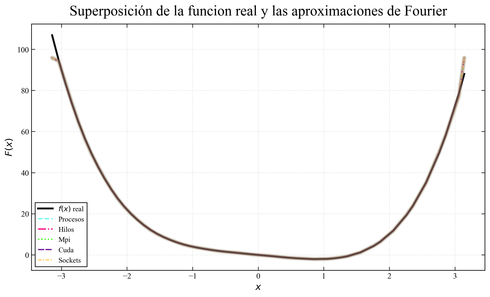
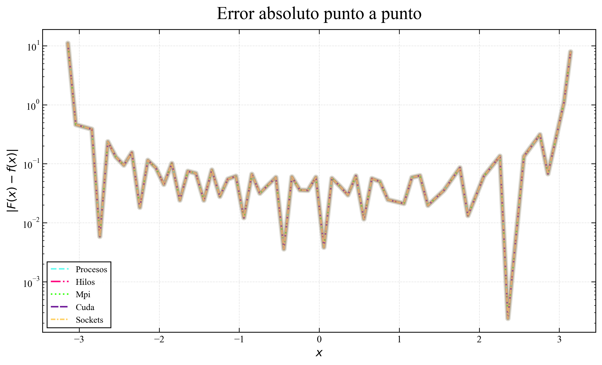
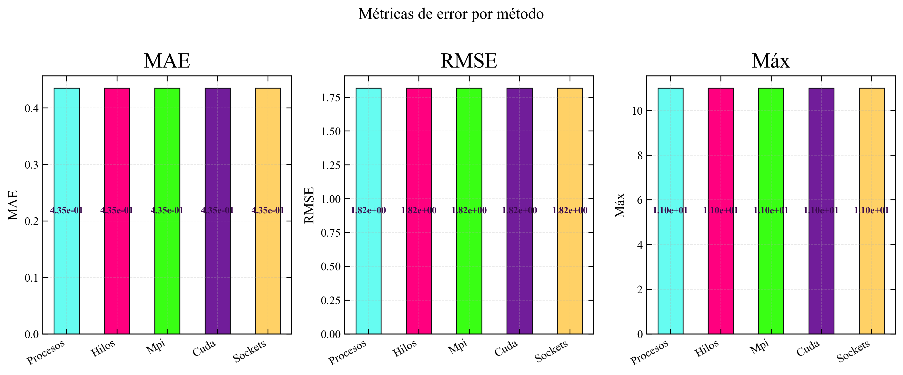
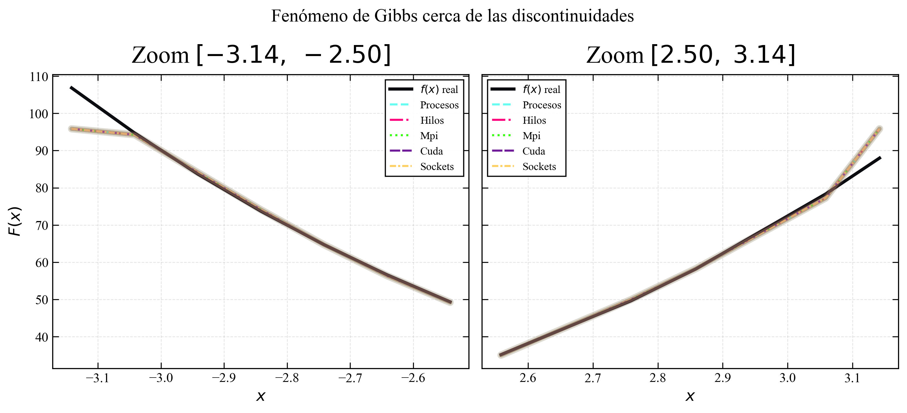
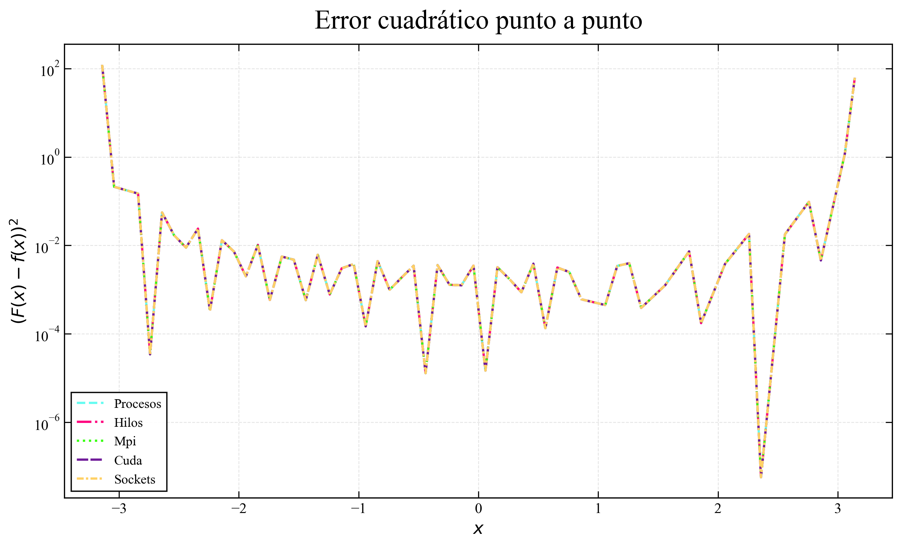
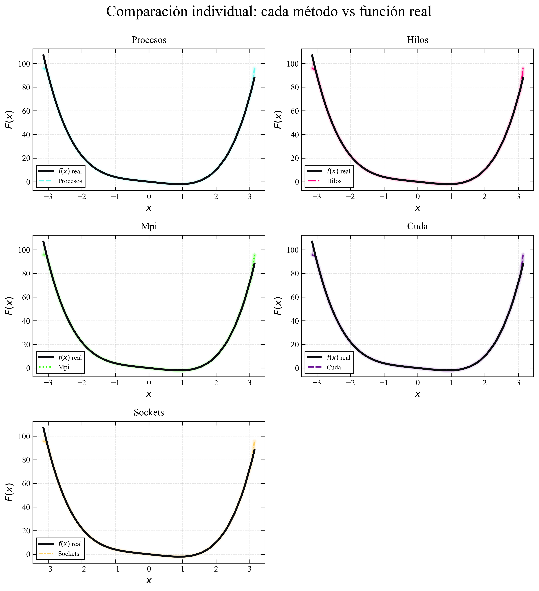

# Reporte de Comparativa – Series de Fourier

## 1. Superposicion global

**Figura 1.** Comparacion global de la funcion real $f(x)=x^4-3x$ (linea negra solida) con las aproximaciones de Fourier calculadas mediante computo paralelo (hilos, procesos y MPI). Cada aproximacion se dibuja con un patron discontinuo y un color distintivo de la paleta "caos", superponiendose sin cortes visuales. El halo degradado (*glow*) de cada curva se situa en el fondo para suavizar las transiciones.

---

## 2. Error absoluto punto a punto

**Figura 2.** Error absoluto $|F(x)-f(x)|$ en escala logaritmica. Valores menores indican mayor precision de la aproximacion. Los picos recurrentes evidencian las oscilaciones propias del fenomeno de Gibbs en las proximidades de las discontinuidades periodicas.

---

## 3. Metricas de error

**Figura 3.** Barras comparativas del MAE, RMSE y error maximo absoluto para cada metodo de calculo.

### Tabla resumen

| Método   |                 MAE |               RMSE |                Máx |
|:---------|--------------------:|-------------------:|-------------------:|
| Procesos | 0.4349458465141609  | 1.8161394511194562 | 10.99124156328132  |
| Hilos    | 0.4349458465141609  | 1.8161394511194562 | 10.99124156328132  |
| Mpi      | 0.4349458465141609  | 1.8161394511194562 | 10.99124156328132  |
| Cuda     | 0.43494584651416535 | 1.816139451119451  | 10.991241563281278 |
| Sockets  | 0.4349458465141609  | 1.8161394511194562 | 10.99124156328132  |

**Tabla 1.** Resumen numerico de las metricas de error para cada metodo evaluado.

---

## 4. Fenomeno de Gibbs

**Figura 4.** Ampliacion de las regiones adyacentes a las discontinuidades periodicas ($\pm\pi$). El *overshoot* caracteristico del fenomeno de Gibbs es observable en el extremo derecho de cada panel.

---

## 5. Error cuadratico

**Figura 5.** Error cuadratico $(F(x)-f(x))^2$ en escala logaritmica. Esta metrica amplifica las desviaciones de mayor magnitud.

---

## 6. Comparacion individual por paneles

**Figura 6.** Paneles individuales que contrastan cada aproximacion (linea discontinua) con la funcion real (negro solido). El sombreado semitransparente resalta la zona de discrepancia.

---

## Conclusiones

- **Equivalencia numerica:** Los metodos implementados en C (hilos, procesos y MPI) producen resultados identicos en precision.
- **Fenomeno de Gibbs:** Todas las aproximaciones exhiben el clasico *overshoot* en las discontinuidades de $\pm\pi$.
- **Exactitud de la linea base:** La funcion real $f(x)=x^4-3x$ se recalcula directamente sobre la grilla de cada CSV, eliminando toda dependencia de grillas externas y garantizando metricas de error fidedignas.
